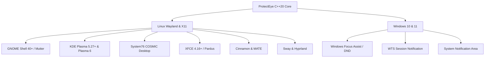

<div align="center">


# ProtectEye 👁️

**Evidence-Based, Cross-Platform Eye Health & Digital Ergonomics Assistant**  
*Engineered with C++20 and Qt6 for Wayland & X11 (GNOME, KDE Plasma, COSMIC, XFCE, Sway) and Windows 10/11*

<p align="center">
  <i>"A sound mind dwells in a healthy body."</i><br/>
  — <b>Mustafa Kemal Atatürk</b>
</p>

[](https://github.com/alierenaltindag/protect-eye/actions/workflows/ci.yml)
[](https://opensource.org/licenses/MIT)
[](https://en.wikipedia.org/wiki/C%2B%2B20)
[](https://www.qt.io/)
[](#-quick-install)
[-blueviolet.svg)](#-11-supported-languages--rtl-architecture)

<p align="center">
  <b><a href="README.md">English</a></b> •
  <b><a href="README_TR.md">Türkçe Dokümantasyon</a></b>
</p>

<p align="center">
  <a href="#-screenshots">Screenshots</a> •
  <a href="#-quick-install">Quick Install</a> •
  <a href="#-pre-built-packages">Packages</a> •
  <a href="#-scientific--evidence-based-foundations">Scientific Foundations</a> •
  <a href="#-11-supported-languages--rtl-architecture">Languages & RTL</a> •
  <a href="#-features">Features</a> •
  <a href="#-platform-support-matrix">Compatibility</a> •
  <a href="#-building-from-source">Build</a>
</p>

</div>

---

## 📸 Screenshots

<div align="center">
  <p><b>A gentle reminder when your eyes need rest.</b><br/>
  When it's time for a break, ProtectEye smoothly covers your screen and guides you through simple, relaxing exercises to relieve eye strain and keep your focus sharp.</p>
  
</div>

---

## ⚡ Quick Install

### 🐧 Linux (Universal Auto-Installer)

Install ProtectEye system-wide with a single command. The script automatically detects your distribution (**Ubuntu, Debian, Pardus, Fedora, Arch, CachyOS, openSUSE**), handles dependencies, builds from source, installs application icons, and enables background autostart:

```bash
curl -fsSL https://raw.githubusercontent.com/alierenaltindag/protect-eye/main/installer.sh | bash
```

*Or install locally from source:*
```bash
git clone https://github.com/alierenaltindag/protect-eye.git
cd protect-eye
chmod +x installer.sh
./installer.sh
```

---

### 🪟 Windows (10 & 11)

1. Download the latest **`ProtectEye_<version>_Setup.exe`** (e.g. `ProtectEye_1.0.4_Setup.exe`) from [**GitHub Releases**](https://github.com/alierenaltindag/protect-eye/releases).
2. Run the installation wizard.
3. Keep *"Start automatically on Windows boot"* checked (recommended).
4. ProtectEye will quietly launch in your system tray and protect your eyesight!

---

## 📦 Pre-Built Packages

Directly install pre-built binaries from our [**GitHub Releases**](https://github.com/alierenaltindag/protect-eye/releases):

| Operating System | Package Format | Direct Install Command |
|---|---|---|
| **CachyOS / Arch Linux** | `.pkg.tar.zst` | `sudo pacman -U protecteye-1.0.0-1-x86_64.pkg.tar.zst` |
| **Ubuntu / Debian / Pardus** | `.deb` | `sudo apt install ./protecteye_1.0.0_amd64.deb` |
| **Fedora / RHEL** | `.rpm` | `sudo dnf install ./protecteye-1.0.0-1.x86_64.rpm` |
| **openSUSE** | `.rpm` | `sudo zypper install ./protecteye-1.0.0-1.x86_64.rpm` |
| **Windows 10 / 11** | `.exe` Installer | Double-click `ProtectEye_<version>_Setup.exe` |

---

## 🧬 Scientific & Evidence-Based Foundations

ProtectEye is not built on gimmicks or pseudoscientific "eye yoga". Every interval, animation frequency, and exercise sequence is engineered strictly around peer-reviewed ophthalmological and ergonomic consensus:

### 1. The 20-20-20 Rule (AAO & AOA Endorsed)
* **Physiological Problem:** Continuous screen focus (50–70 cm) forces continuous isometric contraction of the **ciliary muscle** to maintain lens accommodation, leading to *asthenopia* and *pseudomyopia* (accommodative spasm).
* **ProtectEye Mechanism:** Short breaks enforce looking into optical infinity ($\ge 6\text{ meters} / 20\text{ feet}$) for 20 seconds every 20 minutes, allowing the ciliary muscle to relax completely and resetting the zonular tension (endorsed by the **American Academy of Ophthalmology** and **American Optometric Association**).

### 2. Meibomian Gland Expression (`Deep Squeeze Blinking`)
* **Physiological Problem:** Spontaneous blink rates plummet from 18–20 blinks/min down to 5–7 blinks/min during screen concentration, with over 60% being incomplete micro-blinks. This destabilizes the tear film (lowered TBUT) and accelerates Evaporative Dry Eye Disease.
* **ProtectEye Mechanism:** Based on **Dr. Donald Korb’s** clinical dry-eye protocol: a 6-second guided cycle (**2s Close $\to$ 2s Gentle Squeeze $\to$ 2s Open & Relax**). Gentle contraction of the *orbicularis oculi* compresses the tarsal plates, expressing vital meibum lipids to rebuild the tear film's anti-evaporative monolayer.

### 3. Accommodative Facility (`Near-Far Focus Shift`)
* **ProtectEye Mechanism:** Rapidly alternating focus between a near target (thumb at 15 cm) and a distant horizon (3 seconds each) exercises the ciliary-zonular apparatus, actively restoring accommodative flexibility and reducing transition latency between screen and room environments.

### 4. Extraocular Muscle Mobilization (`Smooth Pursuit at 0.16–0.20 Hz`)
* **Physiological Problem:** Prolonged reading traps eyes in repetitive micro-saccades across a narrow 15°–30° visual field, straining the four recti and two oblique extraocular muscles.
* **ProtectEye Mechanism:** Smooth 60 FPS particle guides along Lemniscate ($\infty$) and Orbit paths running at **0.16–0.20 Hz** (6.0s & 5.0s periods). This stays well below the 30°/s physiological threshold, ensuring continuous **smooth pursuit** without inducing corrective saccades or nystagmus.

### 5. Parasympathetic Reset & Vagal Tone (`Coherent Breathing & Panoramic Vision`)
* **ProtectEye Mechanism:** 
  * `PeripheralExpansion`: Shifts vision from high-stress central foveal tunneling to panoramic vision, a known neurobiological trigger for parasympathetic nervous activation (Prof. Andrew Huberman, Stanford Neurobiology).
  * `BreathingCircle`: Employs an 8-second pacing ring (4s inhale / 4s exhale at **0.125 Hz**), matching the clinical resonance frequency for heart rate variability (HRV) optimization and vagus nerve stimulation.

### 6. Musculoskeletal Ergonomics (NIOSH, OSHA & Cornell Web)
* **Long Break Design:** 2 minutes every 50 minutes, aligned with **NIOSH** / **OSHA** Visual Display Terminal (VDT) guidelines and **Cornell University Ergonomics Web** micro-break protocols:
  * **Chin Tuck:** Aligns the cervical spine over the shoulders, decompressing suboccipital nerves strained by "Tech-Neck" (which places up to 27 kg of abnormal force on neck vertebrae).
  * **Torso & Spinal Twist:** Relieves intradiscal spinal compression caused by prolonged sitting.
  * **Psoas & Hip Flexor Stretch:** Counteracts chronic shortening of the psoas muscle to prevent lumbar lordosis issues.
  * **Stand & Walk:** Engages the calf muscle pump (*gastrocnemius/soleus*) to stimulate venous return and reduce deep vein thrombosis risk.

---

## 🌍 11 Supported Languages & RTL Architecture

ProtectEye features zero-dependency, comprehensive localization across the top 10 most spoken world languages + Turkish, with culturally accurate translations and native Right-to-Left (RTL) layout rendering:

| Language | Native Name | Code | Layout Direction | Notes |
|:---|:---|:---:|:---:|:---|
| **English** | English | `en` | Left-to-Right | Base catalog & medical terminology |
| **Turkish** | Türkçe | `tr` | Left-to-Right | Native complete support |
| **Chinese** | 简体中文 | `zh` | Left-to-Right | CJK font-weight optimized |
| **Hindi** | हिन्दी | `hi` | Left-to-Right | Devanagari script compliant |
| **Spanish** | Español | `es` | Left-to-Right | Standard European & Latin American |
| **French** | Français | `fr` | Left-to-Right | Ergonomic health terminology |
| **Arabic** | العربية | `ar` | **Right-to-Left (RTL)** | **Dynamic RTL layout, cursive ligature preservation** |
| **Bengali** | বাংলা | `bn` | Left-to-Right | Full Unicode typography |
| **Portuguese** | Português | `pt` | Left-to-Right | Brazilian & European Portuguese |
| **Russian** | Русский | `ru` | Left-to-Right | Cyrillic typography compliant |
| **Japanese** | 日本語 | `ja` | Left-to-Right | Natural Japanese ergonomic phrasing |

* **Zero-Restart Switching:** Change languages instantaneously in the Preferences dialog.
* **Smart Locale Detection:** Prioritizes `QLocale::system().uiLanguages()` (honoring `LANGUAGE` and `LC_MESSAGES`) over formatting variables.
* **Full RTL Mirroring:** When Arabic is active, the entire application switches to `Qt::RightToLeft`, mirroring spinboxes, combo-box drop-down arrows, margins, and padding while preserving Arabic cursive letter shaping.

---

## 🖥️ Platform Support Matrix

ProtectEye is built natively for Wayland, modern X11 compositors, and Windows:



### Linux Desktop Environments & Distros
- **Distributions:** Ubuntu, Debian, Pardus 21/23, Fedora 39+, Arch Linux, CachyOS, openSUSE Tumbleweed/Leap, RHEL/CentOS.
- **Wayland & Multi-Monitor Support:** Spawns independent fullscreen overlays per connected screen (`QGuiApplication::screens()`). Fully supports dynamic display hot-plugging.
- **Smart "Do Not Disturb" (DND) & Fullscreen Integration:**
  - **Fullscreen Detection:** Detects active full-screen windows via X11 `_NET_WM_STATE_FULLSCREEN` and FreeDesktop `Inhibited` status to prevent break overlays during movies, presentations, and games.
  - **GNOME:** Reads `org.gnome.desktop.notifications show-banners` via D-Bus.
  - **KDE Plasma:** Queries `org.freedesktop.Notifications` (`Inhibited`) and Plasma DND properties.
  - **COSMIC (System76):** Implements FreeDesktop standard notification inhibition.
  - **XFCE & MATE & Cinnamon:** Monitors `xfconf-query` and daemon settings.
  - **Sway & Hyprland:** Natively checks SwayNC (`GetDnd`) and Dunst (`isPaused`).
- **Screen Lock & Sleep Monitoring:** Listens to `systemd-logind` session-specific paths (via `GetSessionByPID`) and desktop screensaver interfaces. Automatically pauses countdowns on lock, safely aborts active break overlays to prevent lock-screen deadlocks, and refreshes timers upon unlock.

### Windows 10 & 11
- **Focus Assist & Fullscreen Gaming/Presentations:** Integrates with `SHQueryUserNotificationState` to detect `QUNS_RUNNING_D3D_FULL_SCREEN` (DirectX/Vulkan games & full-screen video), `QUNS_PRESENTATION_MODE` (slideshows & presentations), Alarms Only, and Quiet Hours—silently postponing breaks.
- **Session Notifications:** Registers with `WTSRegisterSessionNotification` for instant workstation lock/unlock detection.
- **Tray & Audio:** Uses low-latency `QSoundEffect` for break bells and native Windows system tray menu.

### 🍎 What about macOS?

> We’d love to protect Mac users' eyes too, but Apple insists on charging a \$99/year toll just for the privilege of giving away free open-source software without Gatekeeper warning users that the app is "damaged". Until someone donates a developer license—or Apple remembers what open source means—macOS support remains in the hands of the community! PRs from certified Mac developers are warmly welcome.

---

## ✨ Features

- **🎯 18 Clinical & Ergonomic Activities:** 10 ocular exercises (eye tracking, accommodation, dry eye relief) and 8 musculoskeletal posture exercises.
- **🎮 Smart Fullscreen & DND Suppression:** Automatically detects when you are running a fullscreen application (DirectX/Vulkan games, presentations, video playback) or have system Do Not Disturb active, silently postponing breaks so your workflow or gaming is never interrupted.
- **🛡️ Single-Instance Guard (IPC):** Uses `QLockFile` with OS PID checks and `QLocalServer`/`QLocalSocket` to prevent duplicate instances and bring existing settings to front on secondary launch.
- **⏱️ Precision Timing:** 20s short breaks every 20 min, 2min long breaks every 50 min. Pre-break chime and warning notification 30s in advance.
- **⏸️ Non-Intrusive Controls:** Press `Esc` or click **"Skip Break"** anytime. Click **"Snooze 2 Min"** if you are typing an urgent message.
- **📌 High-Contrast Tray Icon:** Features an amber pause badge (`||`) visible on both dark and light taskbars across all scaling factors.
- **⚙️ Complete Customization:** Adjust break intervals, break durations, snooze times, chime audio toggles, and exercise animations.

---

## 🖥️ Command Line Options

```bash
# Launch background tray application
protecteye

# Trigger break overlay test immediately:
protecteye --test-break

# Print version:
protecteye --version

# System autostart mode (invoked automatically on OS boot):
protecteye --autostart

# Completely uninstall ProtectEye (Linux):
protecteye uninstall
```

---

## 🗑️ Uninstallation

### Linux
Run directly from your terminal:
```bash
protecteye uninstall
```
*Or execute the standalone uninstaller script:*
```bash
curl -fsSL https://raw.githubusercontent.com/alierenaltindag/protect-eye/main/uninstall.sh | bash
```

### Windows
Uninstall anytime via Windows **Settings > Installed Apps** or via the Start Menu shortcut **ProtectEye > Uninstall ProtectEye**.

---

## 🛠️ Building from Source

### Prerequisites
- C++20 compliant compiler (GCC 11+, Clang 13+, or MSVC 2019+)
- CMake 3.20+ & Ninja
- Qt 6.2+ (`Core`, `Gui`, `Widgets`, `Multimedia`, `Svg`, `DBus` on Linux)

### Linux (Ubuntu / Debian / Arch / Fedora / Pardus)
```bash
# Clone the repository
git clone https://github.com/alierenaltindag/protect-eye.git
cd protect-eye

# Configure and compile
cmake -B build -G Ninja -DCMAKE_BUILD_TYPE=Release
cmake --build build

# Run unit tests (15 comprehensive test suites)
ctest --test-dir build --output-on-failure

# Launch
./build/protecteye
```

### Windows
```cmd
cmake -B build_win -G "Ninja" -DCMAKE_BUILD_TYPE=Release
cmake --build build_win --config Release
```

---

## 🤝 Contributing

Contributions are warmly welcome! Please review our [Contributing Guidelines](CONTRIBUTING.md) and [Code of Conduct](CODE_OF_CONDUCT.md) before submitting pull requests.

---

## 📄 License

Distributed under the **MIT License**. See [LICENSE](LICENSE) for details.

<div align="center">
  <sub>Built with ❤️ for eye health, ergonomics, and digital well-being worldwide.</sub>
</div>
