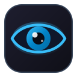
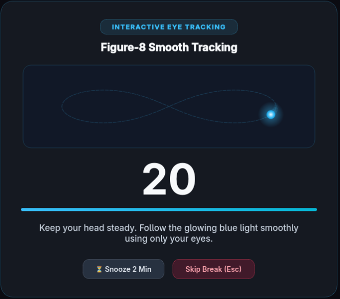
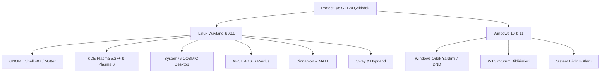

<div align="center">



# ProtectEye 👁️

**Kanıta Dayalı, Çapraz Platform Göz Sağlığı ve Dijital Ergonomi Asistanı**  
*Wayland & X11 (GNOME, KDE Plasma, COSMIC, XFCE, Sway, Hyprland) ve Windows 10/11 için C++20 ve Qt6 ile geliştirilmiştir.*

<p align="center">
  <i>"Sağlam kafa, sağlam vücutta bulunur."</i><br/>
  — <b>Mustafa Kemal Atatürk</b>
</p>

[](https://github.com/alierenaltindag/protect-eye/actions/workflows/ci.yml)
[](https://opensource.org/licenses/MIT)
[](https://en.wikipedia.org/wiki/C%2B%2B20)
[](https://www.qt.io/)
[](#-hızlı-kurulum)
[-blueviolet.svg)](#-11-desteklenen-dil-ve-rtl-mimarisi)

<p align="center">
  <b><a href="README.md">English Documentation</a></b> •
  <b><a href="README_TR.md">Türkçe Dokümantasyon</a></b>
</p>

<p align="center">
  <a href="#-ekran-görüntüleri">Ekran Görüntüleri</a> •
  <a href="#-hızlı-kurulum">Hızlı Kurulum</a> •
  <a href="#-hazır-paketler">Paketler</a> •
  <a href="#-bilimsel-ve-kanıta-dayalı-temeller">Bilimsel Temeller</a> •
  <a href="#-11-desteklenen-dil-ve-rtl-mimarisi">Diller & RTL</a> •
  <a href="#-özellikler">Özellikler</a> •
  <a href="#-platform-uyumluluk-matrisi">Uyumluluk</a> •
  <a href="#-kaynak-koddan-derleme">Derleme</a>
</p>

</div>

---

## 📸 Ekran Görüntüsü

<div align="center">
  <p><b>Gözlerinizin dinlenme vakti geldiğinde yanınızda.</b><br/>
  Mola zamanı geldiğinde ProtectEye ekranınızı nazikçe kaplar; göz yorgunluğunuzu hafifletmek ve odağınızı tazelemek için size adım adım rehberlik eder.</p>
  
</div>

---

## ⚡ Hızlı Kurulum

### 🐧 Linux (Evrensel Otomatik Kurucu)

ProtectEye'ı sisteminize tek bir komutla kurabilirsiniz. Betik dağıtımınızı (**Pardus, Ubuntu, Debian, Fedora, Arch Linux, CachyOS, openSUSE**) otomatik olarak tespit eder, gerekli bağımlılıkları yükler, derlemeyi tamamlar, uygulama simgelerini ve otomatik başlatma (autostart) yapılandırmasını sisteme entegre eder:

```bash
curl -fsSL https://raw.githubusercontent.com/alierenaltindag/protect-eye/main/installer.sh | bash
```

*Veya depoyu klonlayarak yerel olarak kurun:*
```bash
git clone https://github.com/alierenaltindag/protect-eye.git
cd protect-eye
chmod +x installer.sh
./installer.sh
```

---

### 🪟 Windows (10 & 11)

1. [**GitHub Releases**](https://github.com/alierenaltindag/protect-eye/releases) sayfasından en güncel **`ProtectEye_<versiyon>_Setup.exe`** (örn. `ProtectEye_1.0.4_Setup.exe`) yükleyicisini indirin.
2. Kurulum sihirbazını çalıştırın.
3. *"Windows açılışında otomatik başlat"* seçeneğini işaretli bırakın (önerilir).
4. ProtectEye sistem tepsisinde (system tray) sessizce çalışmaya başlayarak göz sağlığınızı koruyacaktır!

---

## 📦 Hazır Paketler

Derlenmiş ikili paketleri doğrudan [**GitHub Releases**](https://github.com/alierenaltindag/protect-eye/releases) sayfasından edinebilirsiniz:

| İşletim Sistemi / Dağıtım | Paket Formatı | Doğrudan Kurulum Komutu |
|---|---|---|
| **Pardus / Debian / Ubuntu** | `.deb` | `sudo apt install ./protecteye_1.0.0_amd64.deb` |
| **Fedora / RHEL** | `.rpm` | `sudo dnf install ./protecteye-1.0.0-1.x86_64.rpm` |
| **openSUSE (Tumbleweed / Leap)** | `.rpm` | `sudo zypper install ./protecteye-1.0.0-1.x86_64.rpm` |
| **CachyOS / Arch Linux** | `.pkg.tar.zst` | `sudo pacman -U protecteye-1.0.0-1-x86_64.pkg.tar.zst` |
| **Windows 10 / 11** | `.exe` Yükleyici | `ProtectEye_<versiyon>_Setup.exe` dosyasını çalıştırın |

---

## 🧬 Bilimsel ve Kanıta Dayalı Temeller

ProtectEye sözdebilimsel "göz yogası" veya asılsız iddialarla değil; hakemli oftalmolojik, optometrik ve ergonomik klinik literatüre tam uyumlu olarak geliştirilmiştir:

### 1. 20-20-20 Kuralı (AAO & AOA Tarafından Onaylı)
* **Fizyolojik Sorun:** Ekrana odaklanırken (50–70 cm çalışma mesafesi) göz merceğinin kırıcılığını artırmak için **siliyer kas** sürekli izometrik kasılma halinde kalır. Bu durum *astenopi* (göz yorgunluğu), baş ağrısı ve *psödomiyopi* (akomodatif spazm) gelişimine yol açar.
* **ProtectEye Mekanizması:** Her 20 dakikada bir 20 saniye boyunca optik sonsuza ($\ge 6\text{ metre} / 20\text{ feet}$) odaklanmayı teşvik eder. Siliyer kas tamamen gevşer, zonül lifleri gerilerek gözün kırma gücü dinlenme konumuna geçer (**Amerikan Oftalmoloji Akademisi - AAO** ve **Amerikan Optometri Derneği - AOA** klinik protokolü).

### 2. Meibomius Bezi Lipid Salgısı (`Bilinçli Sıkı Kırpma / Deep Squeeze Blinking`)
* **Fizyolojik Sorun:** Dijital ekran başında dikkat yoğunlaşmasıyla doğal göz kırpma sıklığı dakikada 18–20'den 5–7'ye düşer ve kırpmaların %60'tan fazlası tamamlanmamış (yarım) kalır. Bu durum gözyaşı buharlaşma süresini (TBUT) kısaltarak Şiddetli Buharlaşmaya Bağlı Kuru Göz Hastalığına (MGD) neden olur.
* **ProtectEye Mekanizması:** Kuru göz alanındaki öncü oftalmolog **Dr. Donald Korb’un** klinik protokolüyle yönlendirilir: 6 saniyelik yönlendirmeli döngü (**2sn Kapat $\to$ 2sn Nazikçe Sık $\to$ 2sn Aç ve Gevşe**). *Orbicularis oculi* kasının tam kasılması tarsal plaklardaki Meibomius bezlerini mekanik olarak uyarır, gözyaşı tabakasının buharlaşmasını önleyen hayati koruyucu lipit katmanını yeniler.

### 3. Akomodasyon Esnekliği (`Yakın-Uzak Odak Değişimi`)
* **ProtectEye Mekanizması:** Yakın bir hedef (15 cm mesafedeki parmak) ile uzak ufuk çizgisi arasında 3'er saniyelik periyotlarla yapılan odak geçişleri, siliyer-zonüler kas mekanizmasını çalıştırır. Akomodasyon esnekliğini (*accommodative facility*) geri kazandırır ve ekran-oda arası odak geçiş gecikmesini ortadan kaldırır.

### 4. Ekstraoküler Kas Mobilizasyonu (`0.16–0.20 Hz Pürüzsüz Takip / Smooth Pursuit`)
* **Fizyolojik Sorun:** Saatlerce metin ve kod okumak gözleri 15°–30° dar bir görsel alanda sürekli küçük sakkadik sıçramalara hapseder; dört rektus ve iki oblik ekstraoküler kas aşırı yorulur.
* **ProtectEye Mekanizması:** 60 FPS akıcı parçacık kılavuzları sonsuzluk ($\infty$) ve dairesel yörüngelerde **0.16–0.20 Hz** frekansında (5.0sn ve 6.0sn periyot) hareket eder. Bu hız insan görsel takip sisteminin 30°/sn olan düzgün takip sınırının altında kalarak düzeltici sakkad ve nistagmus oluşturmadan göz kaslarını gevşetir.

### 5. Parasempatik Sıfırlama ve Vagus Uyarımı (`Koherent Solunum & Panoramik Görüş`)
* **ProtectEye Mekanizması:** 
  * `Görsel Genişleme (Panoramik Bakış):` Görüş alanını tünel odaklanmasından çevresel genişlemeye (panoramik görüş) açar; bu durum sempatik stres sistemini baskılayarak parasempatik tonusu devreye sokar (Stanford Üniversitesi Nörobiyoloji Bölümü, Prof. Andrew Huberman).
  * `Nefes Halkası (Coherent Breathing):` 8 saniyelik rehber halka (4sn nefes al / 4sn nefes ver, **0.125 Hz** rezonans frekansı) ile kalp hızı değişkenliğini (HRV) optimize eder ve vagus siniri üzerinden zihinsel yorgunluğu azaltır.

### 6. Kas-İskelet Sistemi Ergonomisi (NIOSH, OSHA ve Cornell University Web)
* **Uzun Mola Tasarımı:** Her 50 dakikada 2 dakika uzun mola; **NIOSH** (Ulusal İş Sağlığı ve Güvenliği Enstitüsü), **OSHA** (İş Sağlığı ve Güvenliği İdaresi) VDT standartları ve **Cornell Üniversitesi Ergonomi Laboratuvarı** ilkelerine dayanır:
  * **Çene İtme / Boyun Düzeltme (Chin Tuck):** Servikal omurgayı omuz eksenine hizalar; "Tech-Neck" (ekrana eğilme nedeniyle boyna binen 27 kg'a varan anormal yükü) ve suboksipital sinir baskısını giderir.
  * **Gövde ve Omurga Çevirme:** Uzun süreli oturmanın yol açtığı omurlararası disk kompresyonunu hafifletir.
  * **Psoas ve Kalça Esnetme:** Kronik kalça fleksör kısalmasını önleyerek bel lordozunu dengeler.
  * **Ayağa Kalkma ve Yürüme:** Baldır kası pompasını (*gastroknemius/soleus*) devreye sokarak venöz kan dönüşünü artırır ve derin ven trombozu riskini minimize eder.

---

## 🌍 11 Desteklenen Dil ve RTL Mimarisi

ProtectEye, harici hiçbir ağır kütüphaneye ihtiyaç duymadan dünyanın en çok konuşulan 10 dili ve Türkçe için tam yerelleştirme ve Sağdan Sola (RTL) mizanpaj motoru barındırır:

| Dil | Orijinal İsim | Kod | Yönelim | Özel Notlar |
|:---|:---|:---:|:---:|:---|
| **Türkçe** | Türkçe | `tr` | Soldan Sağa (LTR) | Tam yerel ve kültürel terim desteği |
| **İngilizce** | English | `en` | Soldan Sağa (LTR) | Referans medikal katalog ve terminoloji |
| **Çince** | 简体中文 | `zh` | Soldan Sağa (LTR) | CJK font kalınlık ve glif optimizasyonu |
| **Hintçe** | हिन्दी | `hi` | Soldan Sağa (LTR) | Devanagari alfabesi uyumlu |
| **İspanyolca** | Español | `es` | Soldan Sağa (LTR) | Standart Avrupa ve Latin Amerika uyumlu |
| **Fransızca** | Français | `fr` | Soldan Sağa (LTR) | Ergonomik sağlık terimleri sözlüğü |
| **Arapça** | العربية | `ar` | **Sağdan Sola (RTL)** | **Dinamik RTL düzeni, bitişik yazı (cursive ligature) koruması** |
| **Bengalce** | বাংলা | `bn` | Soldan Sağa (LTR) | Tam Unicode dizgisi |
| **Portekizce** | Português | `pt` | Soldan Sağa (LTR) | Brezilya ve Avrupa Portekizcesi |
| **Rusça** | Русский | `ru` | Soldan Sağa (LTR) | Kiril alfabesi tipografi uyumu |
| **Japonca** | 日本語 | `ja` | Soldan Sağa (LTR) | Doğal ergonomik ifadeler |

* **Yeniden Başlatmasız Dil Değişimi:** Tercihler penceresinden dil değiştirildiği anda tüm arayüz, menüler ve bildirimler anında seçilen dile güncellenir.
* **Akıllı Sistem Dili Algılama:** Sistem dili tespit edilirken `QLocale::system().uiLanguages()` (`LANGUAGE` ve `LC_MESSAGES`) önceliklendirilir.
* **Gelişmiş RTL Düzeni:** Arapça seçildiğinde Qt arayüzü otomatik olarak `Qt::RightToLeft` moduna geçer; değer kutuları (spinbox), açılır menü okları, kenar boşlukları ve metin hizalamaları ters çevrilirken harf aralıkları bozunmadan korunur.

---

## 🖥️ Platform Uyumluluk Matrisi

ProtectEye; modern Wayland ve X11 masaüstü ortamları ile Windows 10/11 üzerinde tamamen yerel kodlarla çalışır:



### Linux Masaüstü Ortamları ve Dağıtımlar
- **Dağıtımlar:** Pardus 21/23, Ubuntu, Debian, Fedora 39+, Arch Linux, CachyOS, openSUSE Tumbleweed/Leap, RHEL/Rocky Linux.
- **Wayland & Çoklu Monitör Desteği:** Bağlı tüm monitörleri (`QGuiApplication::screens()`) bağımsız olarak algılar ve her ekrana tam ekran mola katmanı açar. Çalışma anında monitör takıp çıkarma (hot-plugging) tam desteklenir.
- **Akıllı "Rahatsız Etmeyin" (DND) ve Tam Ekran Entegrasyonu:**
  - **Tam Ekran Pencere Tespiti:** X11 `_NET_WM_STATE_FULLSCREEN` ve FreeDesktop `Inhibited` durumunu sorgulayarak tam ekran film, slayt/sunum ve oyun oynarken mola ekranının aniden açılmasını engeller.
  - **GNOME:** D-Bus üzerinden `org.gnome.desktop.notifications show-banners` anahtarını okur.
  - **KDE Plasma:** `org.freedesktop.Notifications` (`Inhibited`) ve Plasma DND durumunu sorgular.
  - **COSMIC (System76):** FreeDesktop bildirim engelleme standardını uygular.
  - **XFCE, MATE & Cinnamon:** `xfconf-query` ve arka plan servislerini izler.
  - **Sway & Hyprland:** SwayNC (`GetDnd`) ve Dunst (`isPaused`) durumlarını yerel olarak denetler.
- **Ekran Kilidi ve Uyku Algılama:** `systemd-logind` oturum yolunu (`GetSessionByPID` ile) ve ekran koruyucu arayüzlerini dinler. Ekran kilitlendiğinde mola sayacını duraklatır; ekran kilidi esnasında açık olan molayı derhal sonlandırarak kilit ekranının kilitlenmesini engeller ve kilit açılınca sayaçları güvenle tazeler.

### Windows 10 & 11
- **Odak Yardımı ve Tam Ekran Oyun/Sunum Tespiti:** `SHQueryUserNotificationState` API'si ile `QUNS_RUNNING_D3D_FULL_SCREEN` (DirectX/Vulkan oyunları ve tam ekran video), `QUNS_PRESENTATION_MODE` (PowerPoint sunumları ve slayt gösterileri), Yalnızca Alarmlar ve Sessiz Saatler durumunu tespit ederek molayı sessizce erteler.
- **Oturum Kilit Bildirimleri:** `WTSRegisterSessionNotification` ile anlık iş istasyonu kilitlenme/kilit açılma olaylarını yakalar.
- **Tepsi ve Düşük Gecikmeli Ses:** Düşük gecikmeli `QSoundEffect` ile mola başlangıç zilleri çalar ve yerel bildirim alanında çalışır.

### 🍎 macOS Sürümü Nerede?

> Mac kullanıcılarının gözlerini de seve seve korumak isterdik; fakat Apple, insanlara bedava bir açık kaynak yazılım hediye edebilmemiz için bile her yıl 99 dolar "vize ücreti" kesmekte ısrarcı. Biri geliştirici lisansı bağışlayana (ya da Apple açık kaynağın ne olduğunu hatırlayana) kadar Mac desteğini topluluğun ellerine bırakıyoruz! Sertifikalı Mac geliştiricilerinden gelecek PR'lar her zaman memnuniyetle karşılanır.

---

## ✨ Özellikler

- **🎯 18 Klinik & Ergonomik Egzersiz:** 10 oküler egzersiz (göz takibi, akomodasyon, kuru göz rahatlaması) ve 8 kas-iskelet postür egzersizi.
- **🎮 Akıllı Tam Ekran & DND Koruması:** Tam ekran çalışan bir oyun (DirectX / Vulkan), sunum (PowerPoint, Impress) veya video oynatımı esnasında ya da sistem Rahatsız Etmeyin modu etkinken molaları sessizce erteler; oyununuzu veya iş akışınızı asla bölmez.
- **🛡️ Tek Örnek Koruması (IPC Guard):** `QLockFile` (PID doğrulama) ve `QLocalServer`/`QLocalSocket` mekanizmasıyla uygulamanın mükerrer açılmasını engeller, ikinci kez açılmaya çalışıldığında mevcut ayarlar penceresini öne getirir.
- **⏱️ Hassas Zamanlama:** Her 20 dakikada 20 saniye kısa mola, her 50 dakikada 2 dakika uzun mola. Mola gelmeden 30 saniye önce nazik ses ve bildirim uyarısı.
- **⏸️ Kullanıcı Dostu Kontroller:** İstediğiniz zaman `Esc` tuşuna basabilir veya **"Molayı Atla"** diyebilirsiniz. Önemli bir mesaj yazıyorsanız **"2 Dk Ertele"** butonuna basabilirsiniz.
- **📌 Yüksek Kontrastlı Tepsi Simgesi:** Açık ve koyu renkli görev çubuklarında, her ölçeklendirme faktöründe net görünen amber renkli duraklatma (`||`) göstergesi.
- **⚙️ Tam Özelleştirme:** Mola süreleri, çalışma aralıkları, erteleme süreleri, sesli bildirimler ve animasyonlar tamamen ayarlanabilir.

---

## 🖥️ Komut Satırı Kullanımı

```bash
# Arka planda sistem tepsisinde başlatır:
protecteye

# Mola ekranını hemen test etmek için:
protecteye --test-break

# Sürüm bilgisini görüntüler:
protecteye --version

# Sistem başlangıç modu (işletim sistemi açılışında otomatik çağrılır):
protecteye --autostart

# ProtectEye'ı sistemden tamamen kaldırır (Linux):
protecteye uninstall
```

---

## 🗑️ Kaldırma (Uninstallation)

### Linux
Terminalden doğrudan çalıştırabilirsiniz:
```bash
protecteye uninstall
```
*Veya bağımsız kaldırma betiğini kullanabilirsiniz:*
```bash
curl -fsSL https://raw.githubusercontent.com/alierenaltindag/protect-eye/main/uninstall.sh | bash
```

### Windows
Windows **Ayarlar > Yüklü Uygulamalar** bölümünden veya Başlat Menüsündeki **ProtectEye > ProtectEye'ı Kaldır** kısayolundan kolayca kaldırabilirsiniz.

---

## 🛠️ Kaynak Koddan Derleme

### Gereksinimler
- C++20 destekleyen derleyici (GCC 11+, Clang 13+ veya MSVC 2019+)
- CMake 3.20+ ve Ninja
- Qt 6.2+ (`Core`, `Gui`, `Widgets`, `Multimedia`, `Svg`, Linux üzerinde `DBus`)

### Linux (Pardus / Ubuntu / Debian / Fedora / Arch)
```bash
# Depoyu klonlayın
git clone https://github.com/alierenaltindag/protect-eye.git
cd protect-eye

# Yapılandırın ve derleyin
cmake -B build -G Ninja -DCMAKE_BUILD_TYPE=Release
cmake --build build

# Birim testlerini çalıştırın (15 kapsamlı test grubu)
ctest --test-dir build --output-on-failure

# Çalıştırın
./build/protecteye
```

### Windows
```cmd
cmake -B build_win -G "Ninja" -DCMAKE_BUILD_TYPE=Release
cmake --build build_win --config Release
```

---

## 🤝 Katkıda Bulunma

Katkılarınızı memnuniyetle kabul ediyoruz! Lütfen katkı sunmadan önce [Katkı Yönergeleri](CONTRIBUTING.md) ve [Davranış Kuralları](CODE_OF_CONDUCT.md) belgelerini inceleyin.

---

## 📄 Lisans

Bu proje **MIT Lisansı** ile lisanslanmıştır. Detaylar için [LICENSE](LICENSE) dosyasına bakabilirsiniz.

<div align="center">
  <sub>Dünya çapında göz sağlığı, dijital ergonomi ve kullanıcı esenliği için ❤️ ile geliştirildi.</sub>
</div>
